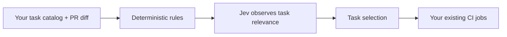

<div align="center">

<h1>jev-ci-selector</h1>
<p><strong>Give every pull request a CI plan.</strong></p>
<p>Let Jev suggest which checks a change needs.<br>Keep your workflows. Start in shadow mode. Measure before you skip.</p>

<p>
  <a href="https://github.com/guilhem/jev-ci-selector/actions/workflows/ci.yml"></a>
  <a href="package.json"></a>
  <a href="tsconfig.json"></a>
  <a href="#start-with-shadow"></a>
</p>

<p>
  <a href="#quick-start">Quick start</a> ·
  <a href="examples/shadow/README.md">Independent observer</a> ·
  <a href="examples/static-jobs/README.md">Static jobs</a> ·
  <a href="examples/matrix/README.md">Matrix example</a> ·
  <a href="docs/paths-filter.md">Migrate from paths-filter</a> ·
  <a href="docs/reference.md">Reference</a> ·
  <a href="SECURITY.md">Security</a>
</p>

</div>

---

A chart change, a networking refactor, and a documentation fix can need very different checks. **jev-ci-selector helps you explore where your CI time is going** by combining your own rules with Jev's assessment of the change.

You define the tasks and the checks that must always run. The action returns a selection plan; your existing jobs keep ownership of commands, runners, secrets, and execution order.

## Why use it?

- **Try it while keeping every check.** Shadow mode records what would be skipped while all tasks still run.
- **Keep the final say.** Mandatory tasks and path rules take precedence over model decisions; workflows own execution dependencies.
- **Fit it into your workflow.** Use a JSON map for existing jobs or a matrix for independent tasks.
- **Inspect every proposal.** Version 4 reports include the catalog/configuration SHA, tested commit, probabilities, deterministic reason codes, timings, and API usage.
- **Test without an API key.** The pure selection engine and the normal test suite work offline.



> [!NOTE]
> This is an experimental MVP. It defaults to `shadow`: every task stays in the CI outputs. Use real run data to decide whether selective execution is right for your repository.

## Quick start

### 1. Start with an independent observer

Use the [independent observer example](examples/shadow/README.md) first. Copy its new `observe.yml` workflow and catalog, then adapt the catalog's `unit` and `build` job references and descriptions to your existing `.github/workflows/ci.yml`. Merge the catalog to the base branch before the pull request you want to observe.

The observer listens to `pull_request`, requests only `contents: read`, never checks out or executes project code, and does not wire outputs into CI jobs. It is an optional evidence workflow, not a required check. Its report artifact is enough to compare the proposal with the separate CI run that actually executed the tasks.

The observer uses `tested-ref: merge` by default, matching the integrated examples and the merge commit that CI tests. Use `tested-ref: head` only when the consumer CI intentionally tests the pull request head and you have checked that the comparison is still meaningful. Fork pull requests, a missing `JEV_API_KEY`, or missing external-context permission bypass the API call and keep the complete plan.

### 2. Choose an integrated workflow

After the observer has produced useful evidence, choose the integration that matches your jobs:

| Your CI looks like… | Start here |
| --- | --- |
| Separate jobs with their own setup and dependencies | **[Static jobs](examples/static-jobs/README.md)** — recommended |
| Independent tasks that share one launch mechanism | [Task matrix](examples/matrix/README.md) |

Both supplied templates call one `select` action step on every event. On a pull request it may observe the diff when authorized. On a push, schedule, or merge group event it reads the catalog at `github.sha`, does not call Jev, and returns the full effective plan. An invalid catalog fails the action; the templates do not silently invent a hardcoded full plan.

Both templates keep `ci-required`, real `needs` dependencies, `tested-sha` checkouts, and their final plan/result checks on every event. They upload the selector's `report-path` as `jev-plan-report-${{ github.run_id }}-${{ github.run_attempt }}` with 14-day retention; that upload is soft-failing so a missing report does not hide a CI result. Their bundled validator remains template-specific and mandatory within those supplied integrated templates. It is not required for the initial observer or for an arbitrary custom workflow.

### 3. Define the catalog and outputs

The catalog lives at `.github/task-routing.yaml`. A small catalog could look like this:

```yaml
model: jev-1.13.0
skip_below: 0.05
tasks:
  unit:
    description: Runs unit behavior tests.
    always: true
    jobs:
      - workflow: .github/workflows/ci.yml
        job: unit
  build:
    description: Runs compilation checks.
    always: true
    jobs:
      - workflow: .github/workflows/ci.yml
        job: build
  helm:
    description: Runs chart rendering checks.
    force_paths: [charts/**/values.schema.json]
    jobs:
      - workflow: .github/workflows/ci.yml
        job: helm
```

`unit` and `build` always run. A change to a chart values schema also forces `helm`; other changes leave it eligible for Jev's assessment. The workflow declares `build` as a prerequisite for `helm`; it stays mandatory here. Describe what each task verifies. A task may reference several jobs; omitting `job` includes all jobs in that workflow.

The action publishes `run`, `selected`, `matrix`, `has-tasks`, `status`, `tested-sha`, and `report-path`. Every catalog task also has a direct output with the same ID, containing the exact string `true` or `false`. Use that direct output when a static job needs one task:

```yaml
jobs:
  helm:
    needs: [plan, build]
    if: ${{ always() && needs.plan.result == 'success' && needs.build.result == 'success' && needs.plan.outputs.helm == 'true' }}
```

The selector step is the only source for the plan job outputs on all events. Keep the aggregate `run` output for final gates and custom consumers; `report-path` is local to the planning runner. For a large custom catalog, use `fromJSON(needs.plan.outputs.run)` and validate the object directly in your gate. Named task outputs and the supplied template validator are conveniences of the fixed examples, not requirements of the action contract. See [the action reference](docs/reference.md#custom-workflow-gates) for the custom pattern.

Pin the action as follows in the release-ready examples:

```yaml
uses: guilhem/jev-ci-selector@v0.1.0
```

`v0.1.0` is the documented release reference; do not treat it as published until the release exists. A repository that requires immutable references can replace it with the full commit SHA for that release and keep the version in a comment.

### 4. Authorize shadow calls

Add `JEV_API_KEY` as a repository secret only after approving the transfer of the diff, changed paths, commit SHAs, task metadata, and questions to TypeSafe. The explicit opt-in is required:

```yaml
with:
  mode: shadow
  api-key: ${{ secrets.JEV_API_KEY }}
  allow-external-context: 'true'
```

Without a key or permission, every task is kept and no Jev call is made. Fork pull requests are also no-call paths. The default provider is TypeSafe at `https://api.typesafe.ai`; the SDK uses `/v1/systemone` and the catalog's canonical `model`. A custom provider must expose the Jev System One contract, not a chat-completions API:

```yaml
with:
  mode: shadow
  api-base-url: https://opencode.ai/zen
  api-model: jev-1.13-free
  api-key: ${{ secrets.OPENCODE_API_KEY }}
  allow-external-context: 'true'
```

The catalog still declares a canonical version such as `model: jev-1.13.0`; the provider response must identify that version. Custom endpoints must use HTTPS and contain no URL credentials, query, or fragment. Invalid API configuration fails before network access, and a model-version mismatch falls back to full CI. See the [evaluation guide](docs/evaluation.md) for contract checks.

Make **`ci-required` a required status check** in your branch protection rule or ruleset when using an integrated template. The check rejects failed planning, invalid plans, and selected tasks that did not succeed.

## See what would change

Imagine every evaluated group returns `0.02` for `helm`, below the `0.05` threshold, and no path rule forces it. The raw scores live in `observation.chunks`; the task has no global probability. Here is an illustrative report excerpt:

```json
{
  "helm": {
    "probability": null,
    "proposed_run": false,
    "run": true,
    "reasons": ["jev-below-threshold", "shadow-mode"]
  }
}
```

The proposal says “skip Helm.” **The actual CI still runs Helm.** Compare that proposal with the task's result and duration at the same tested SHA to learn whether the selection would have helped. The `report-path` output points to the detailed v4 JSON report on the planning runner; the templates save it as an artifact. [Measure shadow runs →](docs/shadow-mode.md)

## Start with shadow

| Mode | What goes into CI outputs | What you learn |
| --- | --- | --- |
| **`shadow`** · default | Every task | The proposed selection, while observing the full run |
| `enforce` · explicit opt-in | Selected and mandatory tasks; workflow `needs` still applies | The effect of applying a measured selection policy |

Keep essential checks under `always: true`. A timeout, API problem, invalid response, or unsupported diff keeps all tasks. Fork PRs never call Jev. Catalog/workflow changes and forced paths keep every task too, but authorized shadow observations can still record model answers for configured tasks. An invalid or unavailable catalog fails the planner because it cannot identify a complete task set.

Both modes group the complete diff by files and directories and retain the answers for each group. The complete diff must still fit `max-diff-bytes`; request count, concurrency and total evaluation time are bounded. See the [shadow guide](docs/shadow-mode.md) for v4 reports, matched-run analysis, and manual observation.

Need an immediate return to full CI? Set `force-all: 'true'` in the selector's inputs.

The initial `0.05` threshold is an experiment, not an error-rate guarantee. Review missed failures, flaky tests, infrastructure incidents, and manually identified relevant suites before opting into `enforce`. [Rollout guide →](docs/shadow-mode.md#from-observation-to-enforce)

## Go deeper

| Looking for… | Read this |
| --- | --- |
| Every input, output, catalog rule, and fallback | [Action reference](docs/reference.md) |
| An independent observer | [Shadow example](examples/shadow/README.md) |
| A workflow with separate jobs and real dependencies | [Static jobs example](examples/static-jobs/README.md) |
| An independent task matrix with an empty-selection gate | [Matrix example](examples/matrix/README.md) |
| Comparing proposals with actual CI outcomes | [Shadow mode guide](docs/shadow-mode.md) |
| Trust boundaries and external data handling | [Security](SECURITY.md) |
| Machine-readable contracts | [Catalog schema](schemas/config.schema.json) · [Report schema](schemas/report.schema.json) |

## Work on the project

With Node.js 24 and Git installed:

```sh
git clone https://github.com/guilhem/jev-ci-selector.git
cd jev-ci-selector
npm ci --ignore-scripts
npm run check
```

The suite covers deterministic selection, real temporary Git repositories, mocked HTTP, the distributed bundle, and the example workflow gates. No TypeSafe key is needed. The shadow analyzer is also available as a standalone Node 24 bundle:

```sh
node dist/analyze-shadow.mjs report.json results.json
npm run analyze:shadow -- report.json results.json
```

After changing bundled code, run `npm run build` and commit `dist/` with its sources and license file. `npm run check:dist` verifies that the shipped bundles match. See the [module map](docs/reference.md#development) to find your way around.

Have a use case or an integration snag? [Open an issue](https://github.com/guilhem/jev-ci-selector/issues). Please keep secrets and private source code out of reports.

## Reproducible Jev qualification

The [committed corpus and runner](tests/evaluation/README.md) use generic synthetic examples with independent relevance annotations. Each case includes its own diff, configuration and source files; no external project checkout is needed. Run `npm run eval:replay` without a key or network. Use `npm run eval:live` explicitly to create a campaign for those same inputs. Read the [evaluation guide](docs/evaluation.md) for how to interpret results.
