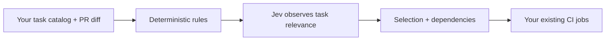

<div align="center">

<h1>jev-ci-selector</h1>
<p><strong>Give every pull request a CI plan.</strong></p>
<p>Let Jev suggest which checks a change needs.<br>Keep your workflows. Start in shadow mode. Measure before you skip.</p>

<p>
  <a href="https://github.com/guilhem/jev-ci-selector/actions/workflows/ci.yml"></a>
  <a href="package.json"></a>
  <a href="tsconfig.json"></a>
  <a href="#start-with-shadow"></a>
</p>

<p>
  <a href="#quick-start">Quick start</a> ·
  <a href="examples/static-jobs/README.md">Static jobs</a> ·
  <a href="examples/matrix/README.md">Matrix example</a> ·
  <a href="docs/paths-filter.md">Migrate from paths-filter</a> ·
  <a href="docs/reference.md">Reference</a> ·
  <a href="SECURITY.md">Security</a>
</p>

</div>

---

A chart change, a networking refactor, and a documentation fix can need very different checks. **jev-ci-selector helps you explore where your CI time is going** by combining your own rules with Jev's assessment of the change.

You define the tasks and the checks that must always run. The action returns a selection plan; your existing jobs keep ownership of commands, runners, secrets, and execution order.

## Why use it?

- **Try it while keeping every check.** Shadow mode records what would be skipped while all tasks still run.
- **Keep the final say.** Mandatory tasks, path rules, and dependencies take precedence over model decisions.
- **Fit it into your workflow.** Use a JSON map for existing jobs or a matrix for independent tasks.
- **Inspect every proposal.** Reports include the tested commit, probabilities, deterministic reason codes, timings, and API usage.
- **Test without an API key.** The pure selection engine and the normal test suite work offline.



> [!NOTE]
> This is an experimental MVP. It defaults to `shadow`: every task stays in the CI outputs. Use real run data to decide whether selective execution is right for your repository.

## Quick start

### 1. Choose an integration

Start from a complete workflow, including its final `ci-required` check:

| Your CI looks like… | Start here |
| --- | --- |
| Separate jobs with their own setup and dependencies | **[Static jobs](examples/static-jobs/README.md)** — recommended |
| Independent tasks that share one launch mechanism | [Task matrix](examples/matrix/README.md) |

Both examples target Go and Helm projects. Adapt the commands and tool setup to your repository. Copy the catalog, workflow, and bundled validator as described in each guide. Keep their task IDs and dependencies in sync.

### 2. Describe what your checks cover

The catalog lives at `.github/ci-selector.yml`. A small catalog could look like this:

```yaml
version: 1
model: jev-1.13.0
skip_below: 0.05

force_all_paths:
  - "ci/**"
  - "go.mod"
  - "go.sum"

tasks:
  unit:
    always: true

  build:
    always: true

  helm:
    requires: [build]
    force_paths: ["charts/**/values.schema.json"]
    question: >
      Does this change affect Helm chart rendering, default values,
      configuration validation, or generated Kubernetes manifests?
```

`unit` and `build` always run. A change to a chart values schema also forces `helm`; other changes leave it eligible for Jev's assessment. Selecting `helm` includes its `build` dependency. Ask whether a change **affects the scope**, rather than whether a test will fail.

Every catalog task also has a direct action output with the same ID. It is the exact string `true` or `false`, so a static job can use its own output without parsing the aggregate map. This job excerpt keeps the build dependency declared above:

```yaml
jobs:
  helm:
    needs: [plan, build]
    if: ${{ always() && needs.plan.result == 'success' && needs.build.result == 'success' && needs.plan.outputs.helm == 'true' }}
```

The planning job should publish that named output from both the pull request selector and the full non-PR plan. Keep the aggregate `run`, `selected`, `matrix`, `has-tasks`, `status`, and `tested-sha` outputs for gates and matrix consumers; `report-path` stays local to the planning runner. See [Migrate from paths-filter](docs/paths-filter.md) for the output and semantics change.

This small catalog illustrates the format; the complete templates include more tasks. Match your catalog to your workflow, and merge it into the base branch before the first PR you want to analyze. The selector reads that trusted base version.

### 3. Enable shadow mode

The selector step in the example workflows is pinned to a published commit containing the action bundle:

```yaml
- name: Plan this pull request
  id: select
  if: ${{ github.event_name == 'pull_request' }}
  uses: guilhem/jev-ci-selector@5ae911f413054938f714f3c6f0eefbe2e3c33c7a
  with:
    mode: shadow
    api-key: ${{ secrets.JEV_API_KEY }}
    allow-external-context: 'true'
```

Add `JEV_API_KEY` as a repository secret and opt in to sending the diff, changed paths, commit SHAs, and task questions to TypeSafe. Shadow mode still makes that external call when authorized. Without a key or permission, every task is kept and no Jev call is made.

The default provider is TypeSafe at `https://api.typesafe.ai`; the SDK calls its
System One endpoint under `/v1/systemone` and uses the catalog's `model`. A
custom provider must expose the Jev System One contract, not a chat-completions
API. For example, this uses OpenCode Zen's temporary free endpoint:

```yaml
with:
  mode: shadow
  api-base-url: https://opencode.ai/zen
  api-model: jev-1.13-free
  api-key: ${{ secrets.OPENCODE_API_KEY }}
  allow-external-context: 'true'
```

The catalog still declares a pinned version such as `model: jev-1.13.0`; the provider must
return that pinned canonical version in its response. The endpoint must use
HTTPS and contain no URL credentials, query, or fragment. Trailing slashes are
normalized. OpenCode Free is temporary; see [its endpoint documentation](https://opencode.ai/docs/zen/#endpoints).
This example documents the provider contract; live inference against OpenCode
was not verified.

This is a **step excerpt**, not a complete workflow. Use the linked templates for job outputs, checkouts at `tested-sha`, dependency wiring, and the final gate. The planning job needs only `contents: read` and must not check out or run PR code.

Make **`ci-required` a required status check** in your branch protection rule or ruleset. It rejects failed planning, invalid plans, and selected tasks that did not succeed. The example workflows run full CI on `push`, `schedule`, and `merge_group` without semantic selection.

## See what would change

Imagine Jev returns `0.02` for `helm`, below the `0.05` threshold, and no path rule forces it. Here is an illustrative report excerpt:

```json
{
  "helm": {
    "probability": 0.02,
    "proposed_run": false,
    "run": true,
    "reasons": ["jev-below-threshold", "shadow-mode"]
  }
}
```

The proposal says “skip Helm.” **The actual CI still runs Helm.** Compare that proposal with the task's result and duration at the same commit to learn whether the selection would have helped.

The job summary gives you a quick view. The `report-path` output points to the detailed JSON file on the planning runner; save it as an artifact if you want to analyze it later. [Measure shadow runs →](docs/shadow-mode.md)

## Start with shadow

| Mode | What goes into CI outputs | What you learn |
| --- | --- | --- |
| **`shadow`** · default | Every task | The proposed selection, while observing the full run |
| `enforce` · explicit opt-in | Selected tasks, mandatory tasks, and their dependencies | The effect of applying a measured selection policy |

Keep essential checks under `always: true`. A timeout, API problem, invalid response, or unsupported diff keeps all tasks. Fork PRs never call Jev. Catalog/workflow changes and forced paths keep every task too, but shadow mode still records model answers for tasks with questions. A policy marked `bypassed` can therefore have a completed model observation. An invalid or unavailable catalog fails the planner because it cannot identify a complete task set.

Large shadow observations split the complete diff into bounded fragments and show the real answers for each fragment. These are not a global model probability, and chunk-based proposals never control `enforce`. The complete diff must still fit `max-diff-bytes`; request count, concurrency and total evaluation time are bounded. See the [shadow guide](docs/shadow-mode.md) for limits and manual PR observation using `workflow_dispatch`.

Need an immediate return to full CI? Set `force-all: 'true'` in the selector's inputs.

The initial `0.05` threshold is an experiment, not an error-rate guarantee. Review missed failures, flaky tests, infrastructure incidents, and manually identified relevant suites before opting into `enforce`. [Rollout guide →](docs/shadow-mode.md#from-observation-to-enforce)

## Go deeper

| Looking for… | Read this |
| --- | --- |
| Every input, output, catalog rule, and fallback | [Action reference](docs/reference.md) |
| A workflow with separate jobs and real dependencies | [Static jobs example](examples/static-jobs/README.md) |
| An independent task matrix with an empty-selection gate | [Matrix example](examples/matrix/README.md) |
| Comparing proposals with actual CI outcomes | [Shadow mode guide](docs/shadow-mode.md) |
| Trust boundaries and external data handling | [Security](SECURITY.md) |
| Machine-readable contracts | [Catalog schema](schemas/config.schema.json) · [Report schema](schemas/report.schema.json) |

## Work on the project

With Node.js 24 and Git installed:

```sh
git clone https://github.com/guilhem/jev-ci-selector.git
cd jev-ci-selector
npm ci --ignore-scripts
npm run check
```

The suite covers deterministic selection, real temporary Git repositories, mocked HTTP, the distributed bundle, and the example workflow gates. No TypeSafe key is needed.

After changing bundled code, run `npm run build` and commit `dist/` with its sources. `npm run check:dist` verifies that the shipped bundles match. See the [module map](docs/reference.md#development) to find your way around.

Have a use case or an integration snag? [Open an issue](https://github.com/guilhem/jev-ci-selector/issues). Please keep secrets and private source code out of reports.
